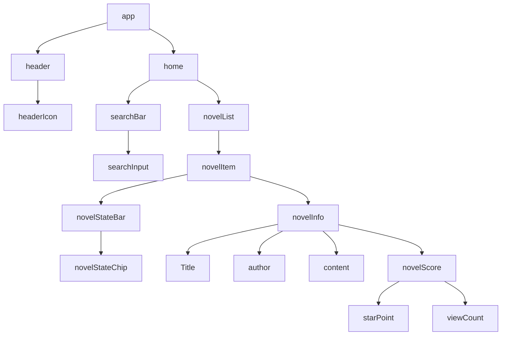

## 컴포넌트 트리

```mermaid
graph TB
    app --> header
    header --> headerIcon
    app --> home
    home --> searchBar
    searchBar --> searchInput
    home --> novelList
    novelList --> novelItem
    novelItem --> novelStateBar
    novelStateBar --> novelStateChip
    novelItem --> novelInfo
    novelInfo --> Title
    novelInfo --> author
    novelInfo --> content
    novelInfo --> novelScore
    novelScore --> starPoint
    novelScore --> viewCount
    
```